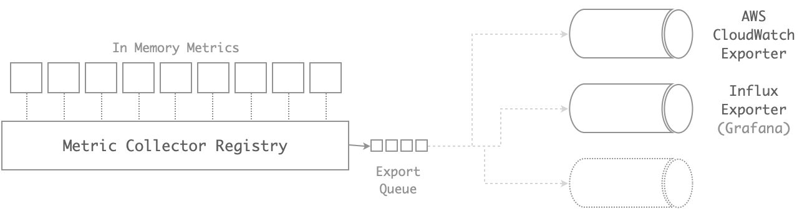

# EASER Insights

n**E**bulous sm**A**ll **S**cale s**E**rvices p**R**ophecies & Insights. A Library for collecting metrics.

[](LICENSE)



### GOALs:
 - Have a Simple way to add metrics to a service
 - Metrics must be self describing (type, label, help, unit)
 - Metrics must be available in json format to be used by a monitoring tool but also as text for a quick debug

### Metric Type
  - **Time Range Counter**: Counts the events over time. This will be rendered with a simple bar/line chart. Usage examples may include the request count, failure count, queue length and so on...
  - **Max and Avg Time Range Gauge**: Like the Time Range Counter but instead of keeping just a count it keeps an avg and a max value. This will be rendered with a simple line chart. This type will be useful to have an idea of what is going on with the Memory Usage or Execution Times.
  - **Histogram**: Keep track of value distribution. This will be rendered with a histogram/bar chart. Usage examples may include the execution times, queue times, request body sizes and so on...
  - **Top K**: Keep track of the slowst/highest events. Useful to find quickly the slowest/larger requests and have a min/max/avg of them.
  - **Counter Map**: Simple counter grouped by a key. This will be rendered with a pie chart. Usage examples may include the count of request types or the count of requests by machine.

### Code
Metrics are registered to a **Collector Registry**,
the code should be trivial and easy to read.

```java
// Declare the Metrics to collect
TimeRangeCounter reqCount = new MetricCollector.Builder()
  .unit(DatumUnit.COUNT)
  .name("http_req_count")
  .label("HTTP Request Count")
  .register(TimeRangeCounter.newMultiThreaded(60, 1, TimeUnit.MINUTES));

CounterMap reqMap = Metrics.newCollector()
  .unit(DatumUnit.COUNT)
  .name("http_req_map")
  .label("HTTP Request Map")
  .register(CounterMap.newMultiThreaded());

MaxAvgTimeRangeGauge execTime = Metrics.newCollector()
  .unit(DatumUnit.MILLISECONDS)
  .name("http_exec_time")
  .label("HTTP Exec Time")
  .register(MaxAvgTimeRangeGauge.newMultiThreaded(60, 1, TimeUnit.MINUTES));

TopK topExecTime = Metrics.newCollector()
  .unit(DatumUnit.MILLISECONDS)
  .name("http_top_exec_time")
  .label("HTTP Top Exec Time")
  .register(TopK.newMultiThreaded(10, 60, 10, TimeUnit.MINUTES));

MetricDimension<Histogram> uriExecTime = Metrics.newCollectorWithDimensions()
  .dimensions("uri")
  .unit(DatumUnit.MILLISECONDS)
  .name("http_endpoint_exec_time")
  .label("HTTP Endpoint Exec Time")
  .register(() -> Histogram.newMultiThreaded(Histogram.DEFAULT_BOUNDS_TIME_MS));

// Collect the new measurements
reqCount.inc();
reqMap.inc("/foo");
execTime.sample(123);
topExecTime.sample("/foo", 123);
uriExecTime.get("/foo").sample(123);
```

### JSON metrics
The JSON format that describes the metric must contains:
A **type** and a **unit** so a monitoring tool will be able to know which chart-type and unit should be used,
and a **label** and the **help** to let the user know what is looking at. The data will be type specific.
```
{
  "name": "metric name",
  "type": "metric type enum",
  "unit": "data unit enum",
  "label": "metric label",
  "help": "metric help",
  "data": ...metric-data...
}
```
Each metric type may be its own data format to provide a more compact version of the data.
```
"time_range_counter_data": {
  "window": window msec,
  "last_interval": timestamp msec,
  "counters": [...data...]
}

"max_and_avg_time_range_gauge_data": {
  "window": window msec,
  "last_interval": timestamp msec,
  "max": [...max data...],
  "sum": [...sum data...]
  "count": [...avg data...],
}

"histogram_data": {
  "bounds': [...bounds...],
  "events": [...events...],
  "num_events": total event count,
  "min_value": bound min value,
  "sum": Events sum,
  "sum_squares": events sum squares
}

"top_k_data": {
  entries: [
    {
      key: measure key,
      max_timestamp: max value timestamp,
      max_value: max value,
      min_value: min value,
      sum: events sum,
      sum_squares: events sum squares,
      count: num events,
      trace_ids: [...top-k trace ids...]
    }
  ]
}

"counter_map_data": {
  keys: [...]
  values: [...]
}
```

### Example of Plain Text metrics dump
For each metric type we can also provide a text version.
```
--- Request Count (last 60min) (server_request_count) ---
Request Count divided by minute
window 1min - 2017-01-08 17:40:00 - [645,378,1.12K,1.18K,1.12K,1.12K,1.13K,657] - 2017-01-08 17:48:00

--- Avg/Max Execution Time over Time (server_execution_avg_max_times) ---
Avg/Max Execution Time divided by minute
window 1min - 2017-01-08 17:40:00 - [57ms/96ms,53ms/103ms,47ms/88ms,50ms/98ms,49ms/105ms,57ms/103ms,51ms/100ms,52ms/103ms] - 2017-01-08 17:48:00

================================================================================
 Hourly Data
================================================================================

--- Execution Time Histo (server_execution_time_histo) ---
Histogram of the server requests execution times
Count:7.36K Min:5ms Mean:62ms Max:150ms
Percentiles: P50:50ms P75:76ms P99:105ms P99.9:105ms P99.99:105ms
----------------------------------------------------------------------
[            0ms,             5ms)     338   4.594%   4.594% #
[            5ms,            10ms)     326   4.431%   9.025% #
[           10ms,            25ms)   1.01K  13.688%  22.713% ###
[           25ms,            50ms)   1.95K  26.478%  49.191% ######
[           50ms,            75ms)   1.82K  24.698%  73.889% #####
[           75ms,           100ms)   1.78K  24.235%  98.124% #####
[          100ms,           150ms)     138   1.876% 100.000% #

--- Top 10 Execution Times (server_execution_top_times) ---
Top 10 server requests with the highest execution time
+--------------+----------------------------+-------+-----+------+------+--------------------------------+
|              | Max Timestamp              | Max   | Min | Avg  | Freq | Trace Ids                      |
+--------------+----------------------------+-------+-----+------+------+--------------------------------+
| /test1       | 2017-01-08 17:47:44.555102 | 105ms | 1ms | 51ms | 6276 | [3197, 3817, 5898, 6290, 6411] |
| /test        | 2017-01-08 17:41:49.349104 | 104ms | 8ms | 52ms | 889  | [65, 122, 144, 213, 372]       |
| /metrics     | 2017-01-08 17:46:10.593914 | 103ms | 2ms | 53ms | 96   | [282, 303, 334, 679, 4664]     |
| /favicon.ico | 2017-01-08 17:47:39.022336 | 100ms | 1ms | 52ms | 96   | [283, 310, 426, 690, 6307]     |
+--------------+----------------------------+-------+-----+------+------+--------------------------------+

--- Count of Requests by Type (server_request_types) ---
 - 85.31% (  6.28K) - /test1
 - 12.08% (    889) - /test
 -  1.30% (     96) - /metrics
 -  1.30% (     96) - /favicon.ico
```